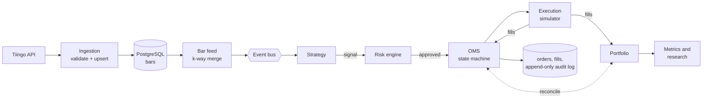

# Aegis Markets


An event-driven trading platform in Python, built to resemble real trading infrastructure: a validated market data pipeline, a strategy engine where look-ahead bias is structurally impossible, pre-trade risk checks, an order management system with an append-only audit log, a realistic execution simulator, portfolio accounting that reconciles against the order system, and research tooling for out-of-sample validation.

105 tests run in CI on every push against a real PostgreSQL 18 database, including a migration drift check.

## What it does

- **Market data:** ingests daily OHLCV bars from the Tiingo API with retries and exponential backoff, parses prices straight into exact decimals, validates every bar, and stores them idempotently in PostgreSQL with source lineage.
- **Strategy engine:** replays bars one at a time through a typed event bus. Strategies only ever receive an immutable window of past bars, and tests prove they can never see future data.
- **Risk engine:** sizes each position from its stop distance, then runs nine configurable pre-trade checks (position size, exposure, risk per trade, daily loss, open positions, duplicates, stop required, buying power, kill switch). Working orders count toward limits, and exits are never blocked.
- **Order management:** orders move through an explicit state machine. Orders and fills are idempotent, and every state change is written to an audit log that a PostgreSQL trigger makes append-only.
- **Execution simulator:** fills at the next bar's open with slippage, commissions and volume limits; models gap risk on stops; attaches stop and target brackets as one-cancels-other orders.
- **Portfolio:** average-cost accounting with realized and unrealized P&L, interest on idle cash, a daily equity curve, and an accounting identity check after every run. Positions are reconciled against the order system's fills.
- **Research:** Sharpe, Sortino, drawdown, Calmar, beta and alpha against a benchmark, trade statistics, parameter sweeps, holdout tests and walk-forward analysis.

## Architecture



For each bar, handlers run in the order a trading day happens: working orders execute against the open, the strategy sees the completed bar, positions are marked to the close, and only then do new signals go through risk and become orders for the next bar.

## Key engineering decisions

- **Look-ahead bias is prevented by structure, not discipline.** The engine finishes every event caused by bar *t* before it reads bar *t+1*, strategies get immutable history, and orders cannot fill on a bar that started before they were submitted.
- **Money is never a float.** Prices and cash are `Decimal` from the vendor's JSON to the database. Statistics, which are estimates anyway, use floats.
- **Idempotency everywhere it matters.** Re-running ingestion never duplicates bars, a retried order returns the existing order, and a duplicate execution report is ignored instead of double-counting shares.
- **The audit log cannot be edited.** A PostgreSQL trigger rejects UPDATE, DELETE and TRUNCATE on order events, so even raw SQL cannot rewrite history.
- **Honest fills.** Stops fill at the open when the price gaps through them, slipped prices round against the trader, and when a stop and a target could both trigger inside one daily bar, the stop is assumed to happen first.
- **Strategies, risk and execution are separate.** Strategies emit signals and never size positions or touch money, so each layer can be tested and replaced on its own.
- **The books must balance.** Equity must equal starting cash plus realized and unrealized P&L minus commissions plus interest, and positions must match the order system's fills, or the run fails.

## Research findings

The included strategy is a simple moving-average crossover across 10 large US stocks and ETFs. It exists to exercise the infrastructure, and the research tools were used to test it honestly:

| Test | Result |
|---|---|
| Holdout: tune on 2018-2022, test on 2023-2025 | Best in-sample parameters: Sharpe 1.12 in-sample, 0.65 out-of-sample |
| Walk-forward: re-tune each year on the prior 3 years, 2021-2025 | Average Sharpe 1.29 in-sample, 0.14 out-of-sample; chosen parameters changed almost every year |
| Compounded out-of-sample, 2021-2025 | Walk-forward +21.4%, fixed parameters +44.0%, SPY buy-and-hold +93.4% |
| 2022 bear market | Strategy about +0.9%, SPY -18.4% |

**Conclusion:** parameter optimization overfits, with almost all of the in-sample advantage disappearing out of sample. The strategy behaves like a low-exposure (about 20% invested) defensive filter: much smaller drawdowns, but far lower returns than buy-and-hold in bull markets. There is no evidence of a tradable edge in returns. See the [dev log](docs/build-log.md) for the full analysis.

## Tech stack

Python 3.13, FastAPI, SQLAlchemy 2.0, PostgreSQL 18, Alembic, Pydantic, httpx, pytest, GitHub Actions

## Getting started

Requirements: Python 3.13+, PostgreSQL 18, and a free [Tiingo](https://www.tiingo.com) API token.

**1. Database.** Create a user and database:

```sql
CREATE USER aegis WITH PASSWORD 'change_me';
CREATE DATABASE aegis OWNER aegis;
```

Or run it in Docker:

```bash
docker run --name aegis-postgres -e POSTGRES_USER=aegis -e POSTGRES_PASSWORD=change_me -e POSTGRES_DB=aegis -p 5432:5432 -d postgres:18
```

**2. Backend.**

```bash
cd backend
python -m venv .venv
source .venv/bin/activate        # Windows: .venv\Scripts\Activate.ps1
pip install -r requirements.txt
cp .env.example .env             # then set DATABASE_URL and TIINGO_API_KEY
alembic upgrade head
pytest -v
```

## Usage

All commands run from `backend/`.

```bash
# Ingest daily bars
python -m app.market_data.ingest --provider tiingo --symbols NVDA AAPL MSFT SPY --start 2018-01-01 --end 2026-01-01

# Run the full pipeline (strategy -> risk -> OMS -> execution -> portfolio) and list every trade
python -m app.trading.replay --symbols NVDA AAPL MSFT SPY --start 2025-01-01 --end 2026-01-01

# Backtest with full metrics against SPY
python -m app.backtest.run --symbols NVDA AAPL MSFT SPY --start 2025-01-01 --end 2026-01-01 --rf 0.04

# Holdout and walk-forward tests
python -m app.backtest.research holdout --symbols NVDA AAPL MSFT SPY --train-start 2018-01-01 --split 2023-01-01 --test-end 2026-01-01
python -m app.backtest.research walkforward --symbols NVDA AAPL MSFT SPY --first-year 2018 --last-year 2025

# API (docs at http://127.0.0.1:8000/docs)
uvicorn app.main:app --reload
```

Backtests run inside a rolled-back transaction, so they leave no rows behind. `app.trading.replay --persist` saves a run's orders, fills and audit log.

## Project structure
backend/
app/
api/ FastAPI routes: health, readiness, bars
market_data/ domain model, providers (Tiingo, Alpaca, fake), ingestion
engine/ events, event bus, bar feed, bar history, signal engine
strategies/ strategy interface, moving-average crossover
risk/ limits and pre-trade risk engine
oms/ order state machine, order manager, models
execution/ cost model and execution simulator
portfolio/ snapshot and portfolio accounting
trading/ end-to-end pipeline and replay CLI
backtest/ metrics, backtest report, research tools
migrations/ Alembic migrations (including the audit-log trigger)
tests/ unit and integration tests
docs/build-log.md engineering log: decisions, problems and results per milestone


## Limitations

- Daily bars only, so the order of prices within a day is unknown (handled with a pessimistic assumption).
- The 10-symbol universe was chosen in hindsight, so every result, including buy-and-hold, carries survivorship bias. A point-in-time universe would fix this.
- A flat interest rate is used for cash and the Sharpe ratio instead of historical T-bill rates.
- Long-only, simulated execution only. The Alpaca provider is tested against a mocked API but has not been run against the live service.

## Roadmap

- Next.js dashboard for positions, orders, signals and equity curves
- Live market data over WebSockets and a live paper-trading loop
- Broker adapters (Alpaca, Interactive Brokers) behind the existing order interface
- AI research agent producing structured analysis that feeds the strategy and risk layers, never placing trades directly
- C++ order book and performance-critical components

## Author

Built by Breijon Peters. The [dev log](docs/build-log.md) records every milestone: what was built, why, what broke and what was learned.
